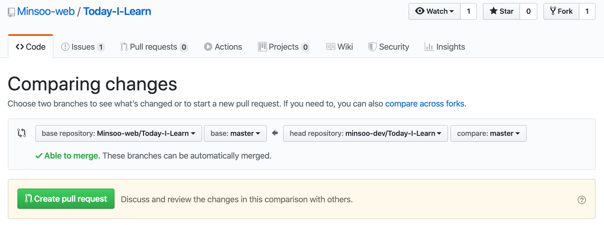
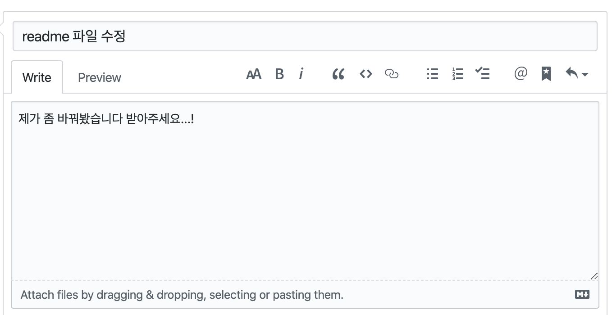
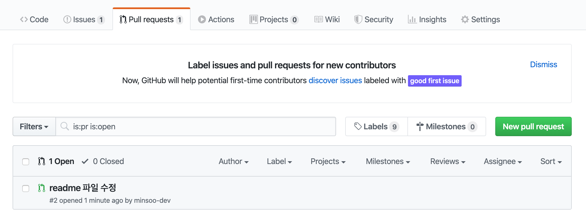
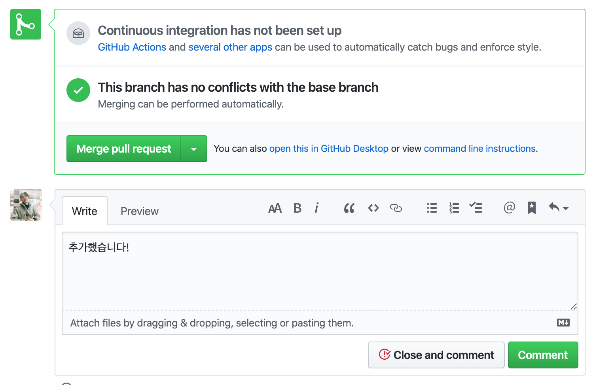

PR 하는 방법 : https://json.postype.com/post/210431 <br/>
fork한 레포 최신 동기화 : https://wayhome25.github.io/git/2017/07/08/git-first-pull-request-story/

협업을 하다 보면 PR이라는 단어가 많이 나온다.
PR은 무엇이고
PR은 어떻게 하는 것인지 알아보자

- 순서
  1. Pull이란?
  2. Pull Request란 ?
  3. fork 한 원격 저장소 최신 동기화

---

# Pull 이란?

PR을 이해하기에 앞서 P에 해당하는 Pull을 먼저 이해할 필요가 있다.

Pull 이란 원격 저장소의 데이터를 로컬 저장소에 가져와 병합하는 git 명령어 중 하나이며 충돌이 없다면 자동으로 merge된다.

git을 사용하다보면 cli 창이나 gui 창에서 orgin/master 와 master의 위치가 상이한 경우를 본 적이 있을 것이다. 이러한 경우는

1. 다른 브랜치에서 작업한 코드를 master에 merge했을 경우
2. 원격 저장소에서 직접 코드를 추가하거나 수정했을 경우 등등

이 있을 것이다.
이럴 경우엔 작업하던 브랜치에 변경된 내용을 적용해야 할 경우가 생길텐데 이를 Pull이 해결해준다.

cli 창을 보며 어떻게 진행되는 지 살펴보자
우선 git fetch 명령어를 실행 시켜준 후에
git adog (git log --all --decorate --oneline --graph )를 해서 log를 본 화면은 다음과 같다.

```
git fetch
git log --all --decorate --oneline --graph
```


원격 저장소의 master에 코드가 추가 되거나 수정이 될 경우
origin/master가 로컬의 master 보다 앞선 것을 볼 수 있다.
HEAD-> 는 현재 브랜치가 머물고 있는 이라는 의미이다.

```git
git status
```


Your branch is behind 'origin/master' by 1 commit
제 마스터 브랜치가 origin/master(=== 원격 저장소) 보다 1 커밋 뒤에 있다 (뒤쳐진다) 라고 친절하게 알려주고 그 다음에 해야 할 명령어도 알려주고 있죠?

시키는 대로 한 번 해봅시다.

```git
git pull
git log --all --decorate --oneline --graph
```


성공적으로 잘 업데이트가 된 것을 알 수 있습니다!

## Pull Request 란?

이제 Pull은 알겠는데 Request란 무엇일까요?
pull은 가져와서 병합한다는 기능이 있음을 위에서 배웠습니다.
그럼 만약 다른 사람의 원격 저장소에 제가 작업한 변경사항을 추가하고 싶다면 어떤 방법이 있을까요?

깃헙은 그에 대한 해결책으로 fork 라는 기능을 제공합니다.
fork는 다른 사람의 원격 저장소를 포크로 찍어오듯 복제해서 자신이 원격 저장소에 저장시키는 기능입니다.

우선 다른 사람의 Git-Hub repository에 가보면  


이렇게 우측 상단에 fork 버튼이 있는 것을 볼 수 있을 겁니다.
fork를 해서 Pull request를 하는 이유는 많지만 그 중 몇가지를 정리해보면

1. 자연스러운 코드 리뷰를 위해
2. Push 권한이 없는 오픈 소스 프로젝트에 기여할 때

Push로 협업을 하게 될 경우에는 많은 문제를 초래하기 쉽습니다. 예를 들면 master 브랜치에 실수로 merge를 할 수도 있고 git 사용에 서투른 사람이 로컬에서나 할 수 있는 실수를 원격 저장소에 영향을 미칠 수도 있으니깐요.

그래서 자신이 작성한 코드나 merge를 요청하게 되는겁니다. <br/>
'네 코드 멋지더라! 근데 내가 조금 수정해 봤거든?<br/> 한 번 봐주라, 괜찮으면 merge 해주고 아니면 말고!' <br/>
이렇게 원격저장소 주인에게 말하는 과정이 _'Pull Request'_ 인 겁니다.
그래서 fork 해서 복제해가는 건 자유지만 수정해서 변경사항을 저장하는건 Pull Request를 통해서 주인에게 허락을 받는 겁니다.


포크를 해가면 자신의 원격 레포에 다음과 같이 포크해온 원격 저장소라고 명시되어 있습니다.

그럼 이제 마지막으로 Pull Request를 하는 방법에 대해서 알아보겠습니다.

1. fork
2. clone, remote 설정
3. branch 생성
4. 수정 작업 후 add, commit, push
5. Pull Request 생성
6. merge Pull Request
7. Merge 이후 동기화 및 branch 삭제

fork까지 마친 상태라는 가정하에 2번부터 실습해보겠습니다.


fork 한 레포에 들어가서 clone or download라는 버튼을 누르면 복사할 URL을 띄워줍니다.
URL을 미리 복사해 놓으시구
cli 창을 띄워서 다음과 같은 명령어를 입력하시면 됩니다.

```
<!-- 로컬 저장소를 만들어줍니다. -->
cd ~
cd desktop
mkdir '폴더이름'
cd '방금만든폴더이름'
git init

<!-- 원격 저장소와 연결해줍니다. -->
git remote add origin '복사한URL'

<!-- 원격 저장소의 데이터를 로컬로 옮깁니다. -->
git pull origin master
```

여기까지 하셨으면 fork한 원격 레포를 로컬 레포로 복사해 오신겁니다.

그럼 이제 브랜치를 생성하고 수정작업까지 해보겠습니다.

```
<!-- 브랜치 생성 -->
git checkout -b patch-1
```


```
git add .
git commit -m "add : git 공부 카테고리 추가"
git push origin patch-1
```

만약 현제 cli 창에 git에 로그인 되어 있는 계정과 push할려는 계정이 다르다면 다음과 같은 에러가 뜰겁니다.


이 부분에 대한 해결 방법은 범위를 넘어서는 것으로 다음 포스팅에서 해결하는 것으로 하고 push가 되었다는 가정하에 다음 단계로 진행하겠습니다.


New Pull Request 버튼을 눌러서 들어가보면
merge 하고 싶은 base를 설정할 수 있습니다.

브랜치를 따서 작성하셨을 경우엔 우측의 compares 브랜치를 수정한 브랜치로 바꿔주시면 됩니다.

약간의 코멘트를 남겨주시면 됩니다.
어딜 어떻게 수정했고 추가한 내용에 대한 대략적인 설명을 적어주시면 됩니다.


이렇게 PR 해주시면 Request를 받은 계정에 메일이 갑니다.




Merge Pull Request를 누르면

PR이 끝나고 변경사항이 반영이 됩니다.

**마지막으로 작업한 자신의 로컬 브랜치는 삭제해주시는 게 좋습니다.**
추가작업이 필요 할 경우 브랜치를 새로 따서 작업해주시면 됩니다.

## 포크한 원격 저장소 최신 상태로 동기화 하기

포크하는 법도 알았고 PR 하는 법도 알아보았는데요
포크를 해서 작업을 하다보면 포크한 계정의 주인이나 다른 사람들이 PR을 해서 자신의 레포와 기존의 레포가 상이해지는 경우가 생깁니다.

- Open Source에 단발성이 아닌 지속적으로 contribution 하려 할 때
- 수정해서 사용하기 위해 fork 해온 원본 repository에서 업데이트된 부분을 받아올 때 등등

이제 동기화 하는 방법에 대해서 알아봅시다.

먼저 원본 repository를 remote repository로 추가해야하니다.
Fork 해온 repository 에서 remote repository를 확인하면 아래와 같이 나올 겁니다.

```
git remote -v
origin http://github.com/your_username/your_fork.git (fetch)
origin http://github.com/your_username/your_fork.git (push)
```

이제 동기화해오고 싶은 원본 repository를 upstream 이라는 이름으로 추가합니다.

```
git remote add upstream http://github.com/original_owner/original_repository.git
```

upstream repository 가 제대로 추가 되었는지 확인해주면

```
git remote -v
origin    https://github.com/YOUR_USERNAME/YOUR_FORK.git (fetch)
origin    https://github.com/YOUR_USERNAME/YOUR_FORK.git (push)
upstream  https://github.com/ORIGINAL_OWNER/ORIGINAL_REPOSITORY.git (fetch)
upstream  https://github.com/ORIGINAL_OWNER/ORIGINAL_REPOSITORY.git (push)
```

이제 fetch 명령어를 통해 최신 상태를 받아옵니다.

```
git fetch upstream
```

그런 다음 master 브랜치로 옮긴 뒤 나의 local master 브랜치로 최신 상태를 merge합니다.

```
git master ( // git checkout master)
git merge upstream/master
```

이 과정까지는 local repository에서 일어난 것이므로 push를 통해 remote repository에 적용시켜주면 완료입니다! 

```
git push origin master
```

만약 이 과정에서 다음과 같은 에러가 뜨실 수 있습니다 (제가 그랬습니다.)

하나하나 읽어보니 push하기 전에 pull을 하라는 거네요. 

```
git pull origin master
git push origin master
```

변경된 사항들이 포크한 제 계정에도 동기화 됨을 확일 할 수 있습니다! 


